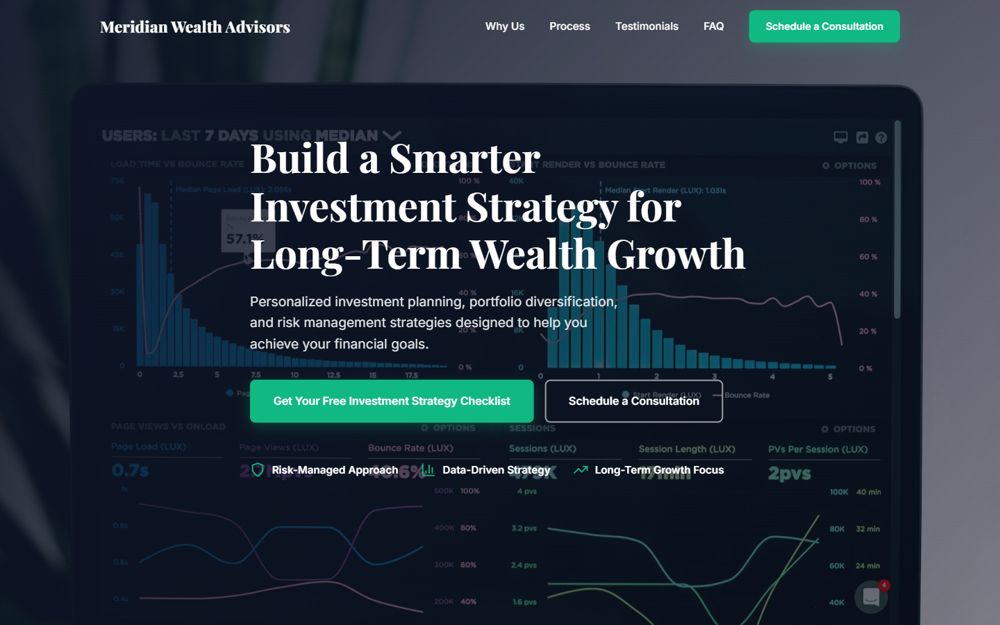

# Meridian Wealth Advisors

A single-page marketing and lead-generation website for Meridian Wealth Advisors, offering investment strategy consultation and portfolio planning services.



## Overview

This is a static, self-contained landing page (`index.html`) with no build system, package manager, or server required. It includes:

- Hero section with primary call-to-action
- Why-us highlights
- Process timeline
- Client testimonials
- Lead-magnet offer
- Enquiry form (submits via [FormSubmit](https://formsubmit.co/))
- FAQ accordion
- Final call-to-action and footer

## Running locally

Open `index.html` directly in a browser, or serve the directory with a static file server if you need to test `fetch`/CORS behavior:

```bash
npx serve
# or
python -m http.server
```

## Deployment

Pushes to `main` automatically deploy the site to GitHub Pages via the workflow in [.github/workflows/deploy.yml](.github/workflows/deploy.yml).
